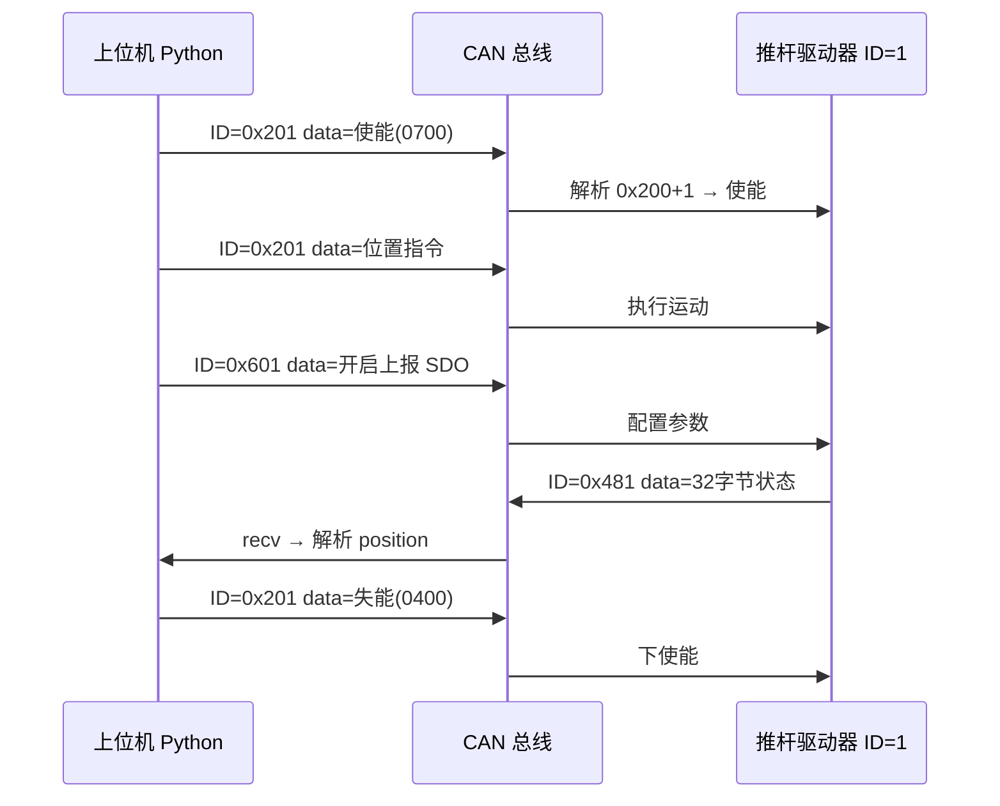

# CAN 通信从零到懂 —— 标准层与本项目协议完整梳理

> 面向完全不懂 CAN 的读者。本文把 **CAN 标准（物理/链路层）** 与 **slider_upper 推杆项目（应用层）** 的关系、转换方式、对应关系全部串起来。
>
> 配套代码：`can.py`、`PCANBasic.py`、`slider_upper.py`、`calib_v3.py`

---

## 目录

1. [先建立直觉：CAN 是什么](#1-先建立直觉can-是什么)
2. [分层模型：不要把两件事混成一件](#2-分层模型不要把两件事混成一件)
3. [CAN 标准：一帧报文长什么样](#3-can-标准一帧报文长什么样)
4. [CAN-FD：本项目用的增强版 CAN](#4-can-fd本项目用的增强版-can)
5. [本项目的硬件与软件栈](#5-本项目的硬件与软件栈)
6. [标识符的两层含义（最容易乱的地方）](#6-标识符的两层含义最容易乱的地方)
7. [应用层协议：LA 推杆怎么编码 ID 和数据](#7-应用层协议la-推杆怎么编码-id-和数据)
8. [数据转换全流程：从 Python 到总线再回来](#8-数据转换全流程从-python-到总线再回来)
9. [完整实例：使能 → 移动 → 读位置](#9-完整实例使能--移动--读位置)
10. [代码与概念对照表](#10-代码与概念对照表)
11. [常见问题 FAQ](#11-常见问题-faq)
12. [延伸阅读](#12-延伸阅读)

---

## 1. 先建立直觉：CAN 是什么

**CAN（Controller Area Network，控制器局域网）** 是一种现场总线，常见于汽车、机器人、工业设备。

可以把它想成一根 **所有设备都挂上去的「广播电话线」**：

- 任何设备都可以 **往总线上发消息**（广播）
- 所有设备都能 **听到** 总线上的消息
- 每条消息有一个 **号码（标识符 ID）** 和一段 **内容（数据）**
- 设备根据 ID 判断「这条是不是发给我的」「这条是什么类型」

在本项目中：

| 角色 | 设备 |
|------|------|
| 主机（上位机） | 你的 Windows 电脑 + PEAK PCAN-USB 适配器 |
| 从机（下位机） | LA 系列电动推杆驱动器（可多个，用关节 ID 区分） |
| 连接线 | CAN_H / CAN_L 双绞线（加终端电阻） |

```
  ┌─────────────┐         CAN 总线          ┌─────────────┐
  │  PC 上位机   │ ═══════════════════════ │  推杆驱动器1  │  关节 ID=1
  │  + PCAN-USB │                         └─────────────┘
  └─────────────┘                         ┌─────────────┐
                                          │  推杆驱动器2  │  关节 ID=2
                                          └─────────────┘
```

---

## 2. 分层模型：不要把两件事混成一件

通信系统通常分层理解。对本项目，只需记住 **三层**：

```
┌────────────────────────────────────────────────────────────┐
│  应用层（你们写的 Python / 推杆协议）                        │
│  · 0x200+关节ID 表示控制命令                                 │
│  · data 里放使能字、目标位置、SDO 配置等                      │
├────────────────────────────────────────────────────────────┤
│  链路层（CAN / CAN-FD 标准）                                 │
│  · 一帧 = 标识符 + 控制位 + 数据段 + CRC 等                   │
│  · 标识符决定总线优先级                                       │
├────────────────────────────────────────────────────────────┤
│  物理层（电缆、收发器、波特率）                               │
│  · CAN_H / CAN_L 电压差表示 0/1                              │
│  · 仲裁段 1Mbps，数据段 5Mbps（CAN-FD）                       │
└────────────────────────────────────────────────────────────┘
```

**关键结论：**

| 你在教材/标准里看到的 | 属于哪一层 | 本项目里谁负责 |
|----------------------|-----------|---------------|
| 仲裁段 = 标识符 + RTR | CAN 标准（链路层） | 硬件 + `PCANBasic.dll` 自动组帧 |
| 标识符是 11 位整数 | CAN 标准（链路层） | `can.py` 的 `arbitration_id` |
| `0x200 + 关节ID` | 推杆协议（应用层） | `slider_upper.py` / `calib_v3.py` 计算 |
| `00000000000700` 表示使能 | 推杆协议（应用层） | 业务代码拼 `data` 字节 |
| 位置在反馈字节 [2:4] | 推杆协议（应用层） | `_update_status_display` 解析 |

**标准只规定「帧格式」；推杆厂商规定「ID 和数据是什么意思」。**

---

## 3. CAN 标准：一帧报文长什么样

### 3.1 经典 CAN 帧（了解即可，本项目用 CAN-FD）

一帧 CAN **数据帧** 在总线上大致包含这些部分：

```
  ┌────────── 仲裁段 ──────────┐
  │  SOF │  标识符(11位)  │ RTR │ IDE │ ... │
  └────────────────────────────┘
  ┌────────── 数据段等 ────────┐
  │  DLC │  DATA[0..7] │ CRC │ ACK │ EOF │
  └────────────────────────────┘
```

| 字段 | 含义（小白版） |
|------|---------------|
| **SOF** | 帧起始，表示「我要开始说话了」 |
| **标识符（ID）** | 11 位数字（标准帧），范围 0~2047（0x000~0x7FF） |
| **RTR** | 远程请求位；**数据帧**一般为 0（本项目发的都是数据帧） |
| **DLC** | Data Length Code，表示后面跟几个数据字节 |
| **DATA** | 实际载荷，经典 CAN 最多 **8 字节** |
| **CRC / ACK / EOF** | 校验、应答、结束；由硬件处理 |

### 3.2 「仲裁」是什么意思

总线上多个设备可能同时想发送。CAN 用 **标识符数值越小，优先级越高** 的规则自动裁决谁先发。

所以标准里的 **「仲裁段」** 指的是：**用来决定总线优先级的那些比特**（主要是 ID + RTR），**不是** 「基础 ID + 关节 ID」 这个应用层公式。

### 3.3 标识符在标准里是什么

在 CAN 标准看来，标识符就是一个 **11 位无符号整数**，例如：

- `0x000`（十进制 0，优先级最高）
- `0x203`（十进制 515）
- `0x7FF`（十进制 2047，标准帧里最大 ID）

标准 **不规定** 这 11 位必须怎么拆成「关节号」「命令类型」——那是上层协议的事。

---

## 4. CAN-FD：本项目用的增强版 CAN

本项目使用 **CAN-FD**（CAN with Flexible Data-rate），在 `can.py` 里默认 `is_fd=True`。

与经典 CAN 的主要区别：

| 特性 | 经典 CAN | CAN-FD（本项目） |
|------|---------|-----------------|
| 数据区最大长度 | 8 字节 | 64 字节 |
| 波特率 | 全程相同 | **仲裁段**与**数据段**可不同 |
| 本项目波特率 | — | 仲裁段 **1 Mbps**，数据段 **5 Mbps** |
| 位速率切换 BRS | 无 | 有（数据段加速传输） |

在 `can.py` 的 `Bus` 类里可以看到波特率配置：

```python
# nom_*  → 仲裁段（Nominal bit rate）1Mbps
# data_* → 数据段（Data bit rate）5Mbps
BitrateFD = b'f_clock_mhz=80, nom_brp=2, nom_tseg1=29, ...'
```

发送时设置帧类型：

```python
# FD 帧 + 比特率切换（BRS）
self.msgCanMessageFD.MSGTYPE = PCAN_MESSAGE_FD.value | PCAN_MESSAGE_BRS.value
```

### 4.1 CAN-FD 帧里的「两段」别和标准里的「仲裁段」搞混

CAN-FD 常说：

- **仲裁段**：用较低波特率传 ID、控制位等（和经典 CAN 类似）
- **数据段**：可切换到更高波特率传 DATA（最多 64 字节）

这里的「仲裁段 / 数据段」指的是 **同一帧里不同部分用不同速度**，仍然是 CAN 标准概念。

而「`0x200 + 关节ID`」是 **应用层给 ID 填什么数**，完全是另一回事。

---

## 5. 本项目的硬件与软件栈

### 5.1 从 Python 到总线的调用链

```
slider_upper.py / calib_v3.py
        │  构造 can.Message(arbitration_id=..., data=...)
        ▼
    can.py（本地模块，勿 pip install python-can）
        │  填充 TPCANMsgFD 结构体（ID, DLC, DATA, MSGTYPE）
        ▼
    PCANBasic.py → PCANBasic.dll
        │  WriteFD / ReadFD
        ▼
    PCAN-USB 硬件
        │  电信号 CAN_H / CAN_L
        ▼
    推杆驱动器
```

### 5.2 底层结构体 `TPCANMsgFD`

`PCANBasic.py` 定义了与驱动交互的 C 结构体：

| 字段 | 类型 | 含义 |
|------|------|------|
| `ID` | `c_uint` | 11 位标识符（本项目用标准帧，非扩展帧） |
| `MSGTYPE` | 枚举 | 标准/扩展、CAN/CAN-FD、是否 BRS |
| `DLC` | `c_ubyte` | 数据长度编码（0~15，与真实字节数非线性对应） |
| `DATA` | `c_ubyte * 64` | 最多 64 字节数据 |

`can.py` 的 `Message` 类就是在 Python 对象和 `TPCANMsgFD` 之间做转换。

### 5.3 接收路径（反向）

```
总线 → PCAN 硬件 → ReadFD → TPCANMsgFD
        → can.Message(msgFD=...) 
        → arbitration_id = msgFD.ID
        → data = bytes(msgFD.DATA[0:实际长度])
        → slider_upper 按协议解析 data
```

---

## 6. 标识符的两层含义（最容易乱的地方）

### 6.1 链路层：标识符 = 一个 11 位整数

在 `can.py` 中：

```python
self.arbitration_id = arbitration_id          # Python 侧
self.msgCanMessageFD.ID = arbitration_id      # 写入硬件结构体
```

接收时：

```python
self.arbitration_id = msgFD.ID
```

这里的 `arbitration_id` **就是 CAN 标准里的那个标识符**，原样进出硬件，**没有**在 `can.py` 里做「拆关节 ID」的操作。

### 6.2 应用层：标识符 = 消息类型基础值 + 关节 ID

推杆协议（类似 CANopen 的 COB-ID 规则）约定：

```
完整标识符 = 基础 COB-ID + 关节 ID（Node ID）
```

关节 ID 范围：**1 ~ 10**（GUI 下拉框可选）

| 基础 ID | 方向 | 用途 |
|---------|------|------|
| `0x200 + id` | 主机 → 驱动 | 使能/失能、位置/速度/电流控制 |
| `0x600 + id` | 主机 → 驱动 | SDO 配置（offset、开启上报、改 ID） |
| `0x480 + id` | 驱动 → 主机 | 状态反馈（32 字节 TxPDO4） |
| `0x180 + id` | 驱动 → 主机 | 状态字 |
| `0x580 + id` | 驱动 → 主机 | SDO 响应 |

### 6.3 举例：关节 ID = 3

| 含义 | 计算 | 完整标识符（十六进制） |
|------|------|----------------------|
| 控制命令 | 0x200 + 3 | **0x203** |
| SDO 配置 | 0x600 + 3 | **0x603** |
| 状态反馈 | 0x480 + 3 | **0x483** |
| SDO 响应 | 0x580 + 3 | **0x583** |

### 6.4 从完整 ID 反解关节号

扫描设备时，代码用 **低 4 位** 提取关节 ID：

```python
aid = msg.arbitration_id      # 例如 0x483
joint_id = aid & 0x000F       # 0x483 & 0xF = 3
```

```
  0x483  =  0100 1000 0011  （二进制示意）
            ──────── ────
            消息类型   关节ID=3（低4位）
```

**关节 ID 不是 CAN 标准里的独立字段**，而是应用层约定「放在 ID 的低 4 位」。

### 6.5 一张图总结

```
                    CAN 标准视角                    推杆协议视角
                    ───────────                    ────────────
标识符 0x203  ──►  11位整数，用于总线仲裁    +    0x200=控制类，+3=3号关节
数据 000...0700 ──►  0~64字节载荷          +    使能控制字 0x0700
```

---

## 7. 应用层协议：LA 推杆怎么编码 ID 和数据

### 7.1 发送辅助函数（项目通用模式）

`calib_v3.py` 中的典型写法：

```python
def send_message(bus, control, data):
    message = can.Message(
        arbitration_id=control + device_id,   # 应用层：拼出完整 ID
        data=bytes.fromhex(data),             # 应用层：十六进制字符串 → 字节
        is_extended_id=False,                 # 链路层：标准 11 位帧
        is_fd=True                            # 链路层：CAN-FD 帧
    )
    bus.send(message)
```

注意两个参数的分工：

| 参数 | 层次 | 谁定义规则 |
|------|------|-----------|
| `arbitration_id` | 链路层字段，值由应用层规则计算 | 推杆协议 |
| `data` | 链路层载荷，字节含义由应用层定义 | 推杆协议 / xlsx 文档 |
| `is_extended_id` / `is_fd` | 链路层帧格式 | CAN 标准 |

### 7.2 控制报文（0x200 + id）数据格式

| 操作 | data（十六进制字符串） | 说明 |
|------|------------------------|------|
| 使能 | `00000000000700` | 控制字 `0x0700` |
| 失能 | `00000000000400` | 控制字 `0x0400` |
| 位置模式 | `01` + 目标(2B小端) + 时长ms(2B小端) + `0F00` | 模式字节 `0x01` |

**位置模式示例**：关节 1，目标 12.34 mm → 内部单位 1234（0.01mm），时长 2000ms：

```
01  D2 04  D0 07  0F 00
│   └─1234─┘ └2000┘ └─固定尾部
模式  目标位置   时长
```

对应 `main.py` / `teach.html` 中的演示：`1234` 表示 12.34mm。

### 7.3 SDO 配置报文（0x600 + id）

SDO（Service Data Object）用于读写驱动器参数。数据是 **十六进制协议串**，需参考厂商 xlsx。

常用示例：

| 操作 | data（hex） | 含义 |
|------|-------------|------|
| 清零 offset | `2B01200500000000` | 写 2 字节到索引 0x2005 子索引 0x01，值为 0 |
| 开启状态上报 | `2B03180520000000` | 配置上报频率等 |
| 修改设备 ID | `2F012001` + new_id(1B) + `000000` | 把关节 ID 改成新值 |

### 7.4 状态反馈报文（0x480 + id，32 字节）

驱动器周期性或应请求上报。字段布局（`slider_upper.py` 中实现）：

| 字节偏移 | 字段 | 类型 | 换算 |
|----------|------|------|------|
| [0:2] | status | uint16 小端 | 状态字 |
| [2:4] | position | int16 小端 | × 0.00001 → mm（代码中显示用） |
| [4:6] | velocity | int16 小端 | × 0.1 → mm/s |
| [6:8] | torque | int16 小端 | N |
| [8:10] | errorcode | uint16 小端 | 故障码 |
| [10:13] | Ia, Ib, Ic | int8×3 | 相电流 |
| [13:16] | udc, idc | 混合 | 母线电压/电流 |
| [16:24] | Id, Iq, Id_ref, Iq_ref | int16×4 小端 | × 0.01 A |
| [28:30] | mos_temp, motor_temp | int8×2 | ℃ |

解析示例（Python）：

```python
pos_val = int.from_bytes(data[2:4], byteorder='little', signed=True)
position_mm = pos_val * 0.00001
```

---

## 8. 数据转换全流程：从 Python 到总线再回来

### 8.1 发送方向（编码）

以「关节 1 使能」为例：

```
【应用层意图】
  关节 ID = 1，发送使能命令

【应用层编码】
  arbitration_id = 0x200 + 1 = 0x201
  data_hex = "00000000000700"
  data_bytes = bytes.fromhex(data_hex)  → 7 字节

【can.py 链路层包装】
  msgCanMessageFD.ID = 0x201
  msgCanMessageFD.DLC = 7              （≤8 时 DLC 等于字节数）
  msgCanMessageFD.DATA[0..6] = 00 00 00 00 00 07 00
  msgCanMessageFD.MSGTYPE = FD | BRS

【PCANBasic / 硬件】
  组 CAN-FD 帧 → 仲裁段发 ID → 数据段以 5Mbps 发 7 字节

【总线】
  所有节点收到 ID=0x201 的帧；驱动器 1 识别后执行使能
```

### 8.2 接收方向（解码）

以「读取关节 1 位置反馈」为例：

```
【应用层意图】
  先开上报，再等 0x480+1 = 0x481 的报文

【发送 SDO 开启上报】
  _send_message(0x600, '2B03180520000000')
  → 实际 ID = 0x601

【接收】
  bus.recv() → Message
  message.arbitration_id == 0x481  → 确认是 1 号关节反馈
  message.data 长度 ≥ 32

【应用层解码】
  position_raw = int.from_bytes(data[2:4], 'little', signed=True)
  显示为 mm
```

### 8.3 DLC 与真实长度的转换（can.py 特有）

CAN-FD 的 DLC 不是「1 字节 = DLC 1」这么简单。`can.py` 实现了 CiA 规范的映射：

| 实际字节数 | DLC 值 |
|-----------|--------|
| 0 ~ 8 | 0 ~ 8 |
| 9 ~ 12 | 9 |
| 13 ~ 16 | 10 |
| ... | ... |
| 33 ~ 48 | 14 |
| 49 ~ 64 | 15 |

推杆 **32 字节状态报文** 走 DLC=13。接收时按 DLC 反查真实长度（见 `can.py` 的 `__init_msgFD`）。

### 8.4 字节序（Endianness）

本项目数据字段几乎都是 **小端（Little-Endian）**：

```
整数 1234（0x04D2）在报文中存为：D2 04
                                    低字节 高字节
```

Python 编码：

```python
(1234).to_bytes(2, byteorder='little', signed=True).hex()  # 'd204'
```

Python 解码：

```python
int.from_bytes(bytes.fromhex('d204'), byteorder='little', signed=True)  # 1234
```

### 8.5 十六进制字符串 ↔ bytes

项目里大量用 hex 字符串写协议，是因为 xlsx / 文档里就是这样给的：

```python
bytes.fromhex('2B01200500000000')   # 发送
data.hex()                          # 调试打印
```

---

## 9. 完整实例：使能 → 移动 → 读位置

假设：**关节 ID = 1**，目标 **50.00 mm**（内部值 5000），移动时间 **1500 ms**。

### 步骤 1：初始化总线

```python
import can
bus = can.Bus()   # 打开 PCAN，配置 CAN-FD 1M/5M
```

### 步骤 2：使能

```python
device_id = 1
bus.send(can.Message(
    arbitration_id=0x200 + device_id,           # 0x201
    data=bytes.fromhex('00000000000700'),
    is_extended_id=False,
    is_fd=True
))
```

| 层次 | 内容 |
|------|------|
| 链路层 ID | `0x201` |
| 链路层数据 | 7 字节 |
| 应用层含义 | 对 1 号关节发送使能 |

### 步骤 3：位置控制

```python
target = 5000      # 50.00mm
duration_ms = 1500
payload = '01' + target.to_bytes(2, 'little', signed=True).hex() \
              + duration_ms.to_bytes(2, 'little', signed=True).hex() + '0F00'
# payload = "018813dc050f00"

bus.send(can.Message(
    arbitration_id=0x201,
    data=bytes.fromhex(payload),
    is_extended_id=False,
    is_fd=True
))
```

### 步骤 4：开启上报并读反馈

```python
# 发 SDO 开启上报
bus.send(can.Message(arbitration_id=0x601,
    data=bytes.fromhex('2B03180520000000'), is_extended_id=False, is_fd=True))

# 等待 0x481
msg = bus.recv(1.0)
if msg and msg.arbitration_id == 0x481 and len(msg.data) >= 32:
    pos = int.from_bytes(msg.data[2:4], 'little', signed=True) * 0.00001
    print(f"位置: {pos:.2f} mm")
```

### 步骤 5：失能

```python
bus.send(can.Message(
    arbitration_id=0x201,
    data=bytes.fromhex('00000000000400'),
    is_extended_id=False,
    is_fd=True
))
```

### 时序图



---

## 10. 代码与概念对照表

| 概念 | CAN 标准/硬件 | 应用层协议 | 代码位置 |
|------|--------------|-----------|----------|
| 标识符 | 11 位仲裁 ID | 0xABC + 关节ID | `Message.arbitration_id` |
| 数据载荷 | DATA[0..63] | 使能字/SDO/位置等 | `Message.data` |
| 帧类型 | 标准/扩展、CAN/FD | 固定 FD+BRS | `is_fd=True` |
| 波特率 | 1M 仲裁 / 5M 数据 | — | `Bus.BitrateFD` |
| DLC | 长度编码 | 32B 反馈→DLC=13 | `can.py` 第 39~55 行 |
| 关节 ID | 无 | ID 低 4 位 | `aid & 0x000F` |
| 发送 | WriteFD | 拼 ID 和 data | `_send_message` / `send_message` |
| 接收 | ReadFD | 按 ID 过滤 | `_receive_message` / `receive_message` |
| 状态解析 | — | 字节偏移+小端 | `_update_status_display` |

---

## 11. 常见问题 FAQ

### Q1：仲裁段到底是「ID+RTR」还是「0x200+关节ID」？

**两者是不同层次：**

- **CAN 标准**：仲裁段是帧里的一个区域，包含 **标识符 + RTR** 等，用于总线优先级裁决。
- **推杆协议**：「0x200 + 关节ID」是你往 **标识符字段里填的数值** 的计算公式。

不矛盾。`0x201` 既是标准意义上的 11 位 ID，也是协议意义上的「发给 1 号关节的控制帧」。

### Q2：`arbitration_id` 是关节 ID 吗？

**不是。** 它是 **完整 11 位 ID**。关节 ID 只是它的组成部分（低 4 位），还要结合高位判断消息类型。

### Q3：为什么有时写 `0x480 + device_id`，有时写 `control + device_id`？

一样。`control` 是基础 COB-ID（如 `0x480`、`0x200`），加上 `device_id` 得到完整 ID。

`calib_v3.py` 的 `receive_message` 传入 `[0x480]` 会在内部自动 `+ device_id`；`slider_upper.py` 有时直接传 `[0x480 + device_id]`。

### Q4：`can.py` 会解析推杆协议吗？

**不会。** `can.py` 只做：

- Python `Message` ↔ `TPCANMsgFD` 结构体转换
- DLC 编解码
- 调用 PCAN 驱动收发

协议逻辑全在上层：`slider_upper.py`、`calib_v3.py`、`main.py`。

### Q5：能不能 pip install python-can？

**不要。** 本项目模块名就是 `can.py`，安装公共库会导致 `import can` 冲突。README 已强调。

### Q6：扩展帧（29 位 ID）用了吗？

**没有。** `is_extended_id=False`，始终 11 位标准帧。

### Q7：没有 xlsx 协议文档能跑吗？

GUI 和校准能发基本命令，但 **完整字段含义、故障码、SDO 索引** 需厂商文档 `KAI执行器通信32字节协议.xlsx`。

---

## 12. 延伸阅读

| 资料 | 说明 |
|------|------|
| [teach.html](teach.html) | 本项目代码四段式讲解 |
| [AI-teach.html](AI-teach.html) | 如何用 AI 协作开发 |
| [README.md](README.md) | 环境、快速开始、协议速查 |
| [can.py](can.py) | 本地 CAN 抽象层源码 |
| PEAK PCAN-Basic 文档 | 硬件驱动 API |

---

## 附录：一张「从点击按钮到推杆动」的总览图

```
用户点击「移动」
       │
       ▼
slider_upper.py
  · 读关节 ID、目标位置
  · 计算 arbitration_id = 0x200 + id
  · 拼接 data 十六进制
       │
       ▼
can.Message(...)          ← 应用层意图变成 CAN 字段
       │
       ▼
can.py
  · ID → msgCanMessageFD.ID
  · bytes → DATA[]
  · 算 DLC，设 FD+BRS
       │
       ▼
PCANBasic.WriteFD
       │
       ▼
CAN 总线物理信号
       │
       ▼
推杆驱动器
  · 看 ID 是否 0x2xx 且 xx=本机关节号
  · 解析 data 执行运动
```

---

*文档版本：与 slider_upper V5.2 代码一致。如有协议更新，以厂商 xlsx 为准。*
